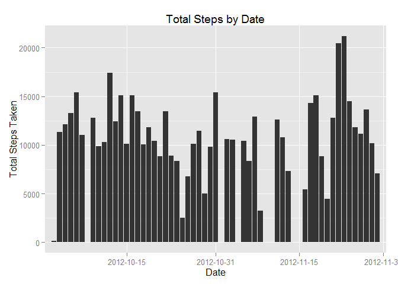
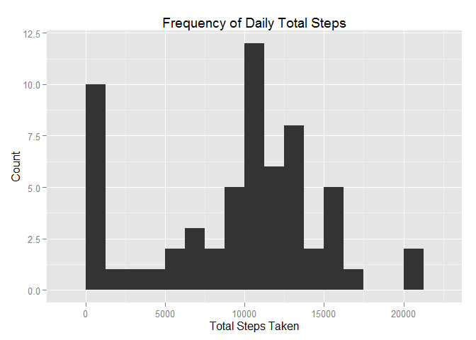
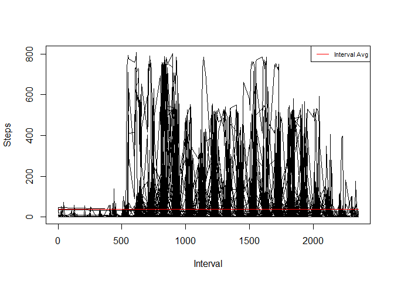
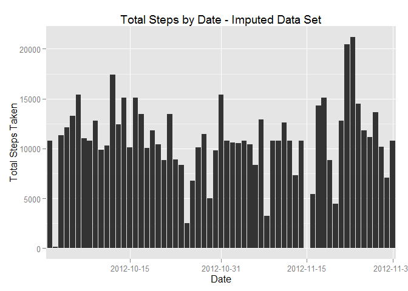
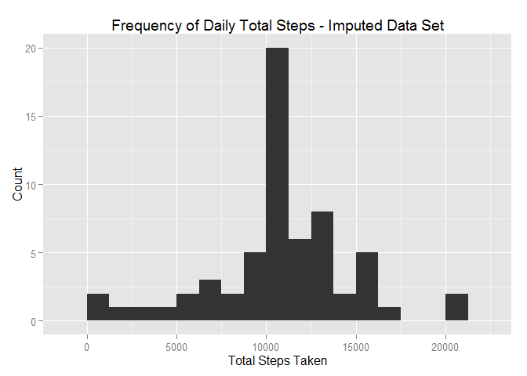
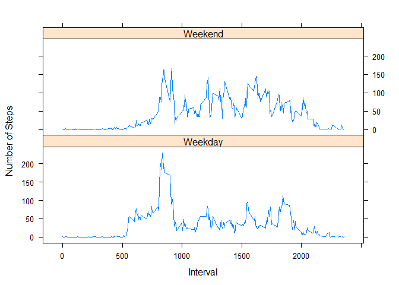

# Reproducible Research: Peer Assessment 1


```r
library(ggplot2)       #Library for plotting
library(lattice)       #Library for plotting
library(dplyr)         #Library for data manipulation
```

## Loading and preprocessing the data

```r
activity <- read.csv("C:/activity.csv", header=TRUE)
```

## What is mean total number of steps taken per day?

```r
tot.steps <- 
  activity %>%
  group_by(date) %>%
  summarize(tot.steps = sum(steps, na.rm=TRUE))

mean.steps <- mean(tot.steps$tot.steps)
median.steps <-median(tot.steps$tot.steps)
```
Mean total number of steps taken per day is 

```r
mean.steps
```

```
## [1] 9354.23
```
Median total number of steps taken per day is

```r
median.steps
```

```
## [1] 10395
```

Histogram of the total number of steps taken each day over the period:

```r
ggplot(tot.steps, aes(x=date, y=tot.steps))+
  geom_bar(stat="identity")+
  scale_x_discrete(breaks=c("2012-10-15", "2012-10-31", "2012-11-15", "2012-11-30"))+
  xlab("Date")+ylab("Total Steps Taken")+
  ggtitle("Total Steps by Date")
```

 

Histogram of the distribution of total steps:

```r
ggplot(tot.steps, aes(x=tot.steps))+
  geom_histogram(binwidth=1250)+
  xlab("Total Steps Taken") + ylab("Count")+
  ggtitle("Frequency of Daily Total Steps")
```

 

## What is the average daily activity pattern?
A time series of the person's 5-minute interval activities is presented below:


```r
#Caculate the interval average steps
activity_1 <- cbind(activity, int.mean=mean(activity$steps, na.rm=TRUE)) 
plot(activity_1$interval, activity_1$steps, type="l", xlab="Interval", ylab="Steps")
lines(activity_1$interval, activity_1$int.mean, col="red")
legend("topright", legend=c("Interval Avg"), lty=c(1), col = c("red"), pt.cex=1, cex=0.7)
```

 

Overall, this person appears to live a very active lifestyle - on many days/interval, he tends to take many steps (and for extended period of time) well above the interval mean across all days.

The maximum number of 5-minute interval steps taken is: 806

```r
max(activity$steps, na.rm=TRUE)
```

```
## [1] 806
```
occurring on this day: 2012-11-27

```r
as.character(activity[which.max(activity$steps), 2])
```

```
## [1] "2012-11-27"
```
and this time interval: 615

```r
activity[which.max(activity$steps), 3]
```

```
## [1] 615
```

## Imputing missing values
The total number of missing values in the dataset is 2304

```r
sum(!complete.cases(activity))
```

```
## [1] 2304
```

The presence of missing data may introduce bias into the calculated summaries. A strategy is adopted below to fill in the NAs with the mean of the particular interval across all days.

```r
# Calculate the mean of the interval across all days
new.activity <-
  activity %>%
  group_by(interval) %>%
  mutate(mean.int.steps = round(mean(steps, na.rm=TRUE), 0))

# Replace the missing values with the interval means
new.activity$steps[is.na(new.activity$steps)] <- new.activity$mean.int.steps[is.na(new.activity$steps)]
```

Now a new data set with all filled in values is contained in the data set new.activity.

```r
new.activity <- select(new.activity, -(mean.int.steps)) # drop the unneeded column
```

We will repeat the analysis in part 1 above with the new data set.

```r
new.tot.steps <- 
  new.activity %>%
  group_by(date) %>%
  summarize(tot.steps = sum(steps, na.rm=TRUE))

new.mean.steps <- mean(new.tot.steps$tot.steps)
new.median.steps <-median(new.tot.steps$tot.steps)
```

And re-creating the histograms above
Histogram of the total number of steps taken each day over the period:

```r
ggplot(new.tot.steps, aes(x=date, y=tot.steps))+
  geom_bar(stat="identity")+
  scale_x_discrete(breaks=c("2012-10-15", "2012-10-31", "2012-11-15", "2012-11-30"))+
  xlab("Date")+ylab("Total Steps Taken")+
  ggtitle("Total Steps by Date - Imputed Data Set")
```

 

Histogram of the distribution of total steps:

```r
ggplot(new.tot.steps, aes(x=tot.steps))+
  geom_histogram(binwidth=1250)+
  xlab("Total Steps Taken") + ylab("Count")+
  ggtitle("Frequency of Daily Total Steps - Imputed Data Set")  
```

 

The new mean steps across all days is

```r
new.mean.steps
```

```
## [1] 10765.64
```
and the new median steps across all days is

```r
new.median.steps
```

```
## [1] 10762
```

The new mean (10766) based on the imputed dat set is now quite a bit above the mean (9354) from the original data set. The new median is slightly higher (10762) than the original (10395), though not largely different.

From the graphs we can see that originally there are many days with missing total steps, which are now filled in. NAs resulted in a large concentration in the original frequency histogram on the far left. The new frequency histogram now appears more symmetrically distributed.

## Are there differences in activity patterns between weekdays and weekends?

We will inspect the difference between the weekday and weekend's average activity levels across intervals by first adding a new column, to indicate whether the given day is a weekday or weekend.

```r
new.activity$weekdays <- weekdays(as.Date(new.activity$date, "%Y-%m-%d"))
new.activity$weekdays.1 <- as.factor(ifelse(new.activity$weekdays %in% c("Saturday","Sunday"), "Weekend", "Weekday")) 

# Compute the average across intervals
new.activity.int <- 
  new.activity %>%
  group_by(interval, weekdays.1) %>%
  summarize(int.mean.steps = mean(steps))
```

Plotting the activity levels by Weekend vs Weekday

```r
with(new.activity.int, xyplot(int.mean.steps~interval|weekdays.1, type="l", layout=c(1, 2), xlab="Interval", ylab="Number of Steps"))
```

 

Overall, this person appears to be more active throughout the day on weekends compared with weekdays.
